# HandleTransactionOutcome
Class: HandleTransactionOutcome

Handles the outcome of a transaction by updating the queue item status, as well as sending out any emails necessary.

## Workflow Details

    

    <b>Namespaces</b>
    

    
- System
- System.Activities
- System.Activities.Statements
- System.Collections
- System.Collections.Generic
- System.Collections.ObjectModel
- System.ComponentModel
- System.Linq
- System.Runtime.Serialization
- UiPath.Core
- UiPath.Core.Activities

    

    <b>References</b>
    

- Microsoft.CSharp
- Microsoft.VisualBasic
- Microsoft.Win32.Primitives
- NPOI
- PresentationFramework
- System
- System.Activities
- System.Collections
- System.ComponentModel
- System.ComponentModel.EventBasedAsync
- System.ComponentModel.Primitives
- System.ComponentModel.TypeConverter
- System.Configuration.ConfigurationManager
- System.Console
- System.Core
- System.Data
- System.Data.Common
- System.Linq
- System.Memory
- System.Memory.Data
- System.ObjectModel
- System.Private.CoreLib
- System.Private.DataContractSerialization
- System.Private.ServiceModel
- System.Private.Uri
- System.Reflection.DispatchProxy
- System.Reflection.Metadata
- System.Reflection.TypeExtensions
- System.Runtime.Serialization
- System.Runtime.Serialization.Formatters
- System.Runtime.Serialization.Primitives
- System.Security.Permissions
- System.ServiceModel
- System.ServiceModel.Activities
- System.Xaml
- System.Xml
- System.Xml.Linq
- UiPath.Studio.Constants
- UiPath.System.Activities
- UiPath.System.Activities.Design
- UiPath.System.Activities.ViewModels
- UiPath.Workflow
- WindowsBase

    

    <b>Arguments</b>
    

| Name | Direction | Type | Description |
|  --- | --- | --- | ---  |
| in_SystemException | InArgument | s:Exception | The System.Exception object within the Process state. |
| in_BusinessException | InArgument | ui:BusinessRuleException | The BusinessRuleException object within the Process state. |
| in_TransactionItem | InArgument | ui:QueueItem | The transaction item to update the status for. |
| in_Data | InArgument | scg:Dictionary(x:String, x:Object) | The dictionary containing the input data and any values added while processing the transaction. |
| in_Config | InArgument | scg:Dictionary(x:String, x:String) | The Config dictionary loaded during the first run. |
| in_TextFiles | InArgument | scg:Dictionary(x:String, x:String) | The TextFiles dictionary loaded during the first run. |

    

    

    <b>Workflows Used</b>
    

- C:\Users\yash.brahmbhatt\Documents\UiPath\LazyFramework\Shared\TakeScreenshot.xaml
- C:\Users\yash.brahmbhatt\Documents\UiPath\LazyFramework\Shared\GenerateDiagnosticDictionary.xaml
- C:\Users\yash.brahmbhatt\Documents\UiPath\LazyFramework\Shared\SendEmail.xaml

    

    

    <b>Tests</b>
    

    

## Outline (Beta)

```mermaid
stateDiagram-v2


Sequence_1: Sequence - HandleTransactionOutcome
state Sequence_1 {
direction TB
LogMessage_5 : LogMessage - LM -- Start
LogMessage_5 --> IfElseIf_1
IfElseIf_1: IfElseIf - Outcome?
state IfElseIf_1 {
direction TB

Sequence_2: Sequence - Handle System Exception
state Sequence_2 {
direction TB
LogMessage_3 : LogMessage - LM -- SE Start
LogMessage_3 --> RetryScope_1
RetryScope_1: RetryScope - Retry - Failed
state RetryScope_1 {
direction TB
SetTransactionStatus_1 : SetTransactionStatus - Set Transaction to Failed (System)
}
InvokeWorkflowFile_1 : InvokeWorkflowFile - Take Screenshot
RetryScope_1 --> InvokeWorkflowFile_1
InvokeWorkflowFile_1 --> If_1
If_1: If - Max Retries Reached?
state If_1 {
direction TB

Sequence_5: Sequence - Handle Max Retries Reached
state Sequence_5 {
direction TB
LogMessage_4 : LogMessage - LM -- Sending Email (System)
InvokeWorkflowFile_2 : InvokeWorkflowFile - Generate Diagnostic (SE)
LogMessage_4 --> InvokeWorkflowFile_2
MultipleAssign_1 : MultipleAssign - Update TemplateData (SE)
InvokeWorkflowFile_2 --> MultipleAssign_1
InvokeWorkflowFile_3 : InvokeWorkflowFile - Send Email (SE)
MultipleAssign_1 --> InvokeWorkflowFile_3
}
}
}
Sequence_2 --> Sequence_3
Sequence_3: Sequence - Handle Business Exception
state Sequence_3 {
direction TB
LogMessage_2 : LogMessage - LM -- BRE Start
LogMessage_2 --> RetryScope_2
RetryScope_2: RetryScope - Retry - Business Exception
state RetryScope_2 {
direction TB
SetTransactionStatus_3 : SetTransactionStatus - Set Transaction to Failed (Business)
}
InvokeWorkflowFile_4 : InvokeWorkflowFile - Generate Diagnostic (BRE)
RetryScope_2 --> InvokeWorkflowFile_4
MultipleAssign_2 : MultipleAssign - Update TemplateData (BRE)
InvokeWorkflowFile_4 --> MultipleAssign_2
InvokeWorkflowFile_5 : InvokeWorkflowFile - Send Email (BRE)
MultipleAssign_2 --> InvokeWorkflowFile_5
}
Sequence_3 --> Sequence_4
Sequence_4: Sequence - Handle Success
state Sequence_4 {
direction TB
LogMessage_1 : LogMessage - LM -- Success Start
LogMessage_1 --> RetryScope_3
RetryScope_3: RetryScope - Retry - Successful
state RetryScope_3 {
direction TB
SetTransactionStatus_4 : SetTransactionStatus - Set Transaction to Failed (Successful)
}
}
}
LogMessage_6 : LogMessage - LM -- Completed
IfElseIf_1 --> LogMessage_6
}
```

