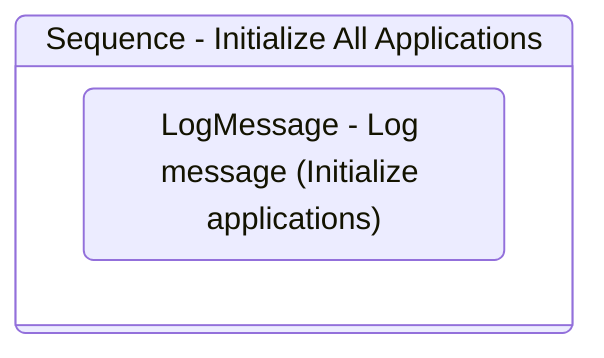

# InitAllApplications
Class: InitAllApplications

Open applications used in the process and do necessary initialization procedures (e.g., login).

## Workflow Details

    

    <b>Namespaces</b>
    

    
- System
- System.Collections.Generic
- System.Data
- System.Linq
- System.Text
- UiPath.Core
- UiPath.Core.Activities
- System.Linq.Expressions
- System.Collections.ObjectModel

    

    <b>References</b>
    

- Microsoft.CSharp
- System
- System.Activities
- System.ComponentModel.TypeConverter
- System.Core
- System.Data
- System.Data.Common
- System.Linq
- System.ObjectModel
- System.Private.CoreLib
- System.Runtime.Serialization
- System.ServiceModel
- System.ServiceModel.Activities
- System.ValueTuple
- System.Xaml
- System.Xml
- System.Xml.Linq
- UiPath.Excel
- UiPath.System.Activities
- UiPath.System.Activities.Design

    

    <b>Arguments</b>
    

| Name | Direction | Type | Description |
|  --- | --- | --- | ---  |
| in_Config | InArgument | scg:Dictionary(x:String, x:Object) |  |

    

    

    <b>Workflows Used</b>
    

    

    

    <b>Tests</b>
    

    

## Outline (Beta)

