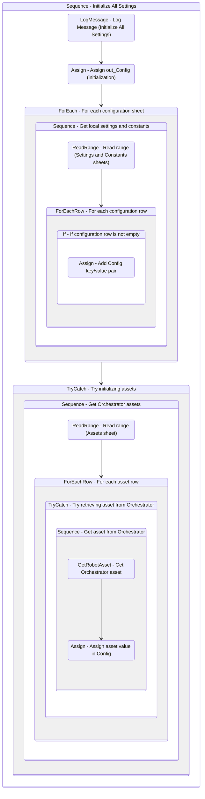

# InitAllSettings
Class: InitAllSettings

Initialize, populate and output a configuration Dictionary to be used throughout the project. 
Settings and constants are read from the local configuration file, and assets are fetched from Orchestrator. 
Asset values overwrite settings and constant values if they are defined with the same name.

## Workflow Details

    

    <b>Namespaces</b>
    

    
- System
- System.Activities
- System.Activities.DynamicUpdate
- System.Activities.Statements
- System.Collections
- System.Collections.Generic
- System.Collections.ObjectModel
- System.ComponentModel
- System.Data
- System.Linq
- System.Linq.Expressions
- System.Reflection
- System.Runtime.InteropServices
- System.Runtime.Serialization
- System.Text
- System.Xml.Serialization
- UiPath.Core
- UiPath.Core.Activities
- UiPath.Excel

    

    <b>References</b>
    

- Microsoft.Bcl.AsyncInterfaces
- Microsoft.CSharp
- NPOI
- PresentationFramework
- System
- System.Activities
- System.ComponentModel
- System.ComponentModel.Composition
- System.ComponentModel.Primitives
- System.ComponentModel.TypeConverter
- System.Core
- System.Data
- System.Data.Common
- System.Linq
- System.Memory
- System.ObjectModel
- System.Private.CoreLib
- System.Private.Xml
- System.Reflection.Metadata
- System.Runtime.Serialization
- System.ServiceModel
- System.ServiceModel.Activities
- System.ValueTuple
- System.Xaml
- System.Xml
- System.Xml.Linq
- UiPath.Excel
- UiPath.Excel.Activities
- UiPath.Studio.Constants
- UiPath.System.Activities
- UiPath.System.Activities.Design
- WindowsBase

    

    <b>Arguments</b>
    

| Name | Direction | Type | Description |
|  --- | --- | --- | ---  |
| out_Config | OutArgument | scg:Dictionary(x:String, x:Object) | Dictionary structure to store configuration data of the process (settings, constants and assets). |
| in_ConfigFile | InArgument | x:String | Path to the configuration file that defines settings, constants and assets. |
| in_ConfigSheets | InArgument | s:String[] | Names of the sheets corresponding to settings and constants in the configuration file. |

    

    

    <b>Workflows Used</b>
    

    

    

    <b>Tests</b>
    

    

## Outline (Beta)

