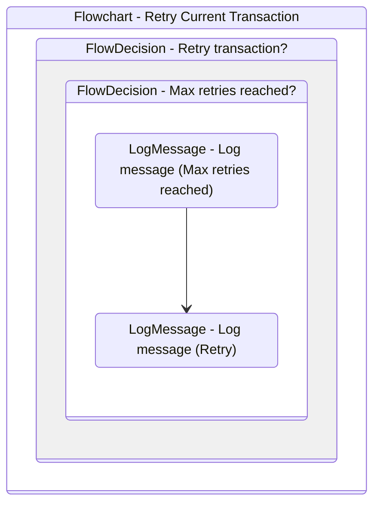

# RetryCurrentTransaction
Class: RetryCurrentTransaction

Manage the retrying mechanism for the framework and it is invoked in SetTransactionStatus.xaml when a system exception occurs. 
The retrying method is based on the configurations defined in Config.xlsx.

## Workflow Details

    

    <b>Namespaces</b>
    

    
- System
- System.Collections.Generic
- System.Data
- System.Linq
- System.Text
- UiPath.Core
- UiPath.Core.Activities
- System.Linq.Expressions
- System.Collections.ObjectModel

    

    <b>References</b>
    

- Microsoft.CSharp
- System
- System.Activities
- System.ComponentModel.TypeConverter
- System.Core
- System.Data
- System.Data.Common
- System.Linq
- System.ObjectModel
- System.Private.CoreLib
- System.Runtime.Serialization
- System.ServiceModel
- System.ServiceModel.Activities
- System.ValueTuple
- System.Xaml
- System.Xml
- System.Xml.Linq
- UiPath.Excel
- UiPath.System.Activities
- UiPath.System.Activities.Design

    

    <b>Arguments</b>
    

| Name | Direction | Type | Description |
|  --- | --- | --- | ---  |
| in_Config | InArgument | scg:Dictionary(x:String, x:Object) | Dictionary structure to store configuration data of the process (settings, constants and assets). |
| io_RetryNumber | InOutArgument | x:Int32 | Used to control the number of attempts of retrying the transaction processing in case of system exceptions. |
| io_TransactionNumber | InOutArgument | x:Int32 | Sequential counter of transaction items. |
| in_SystemException | InArgument | s:Exception | Used during transitions between states to represent exceptions other than business exceptions. |
| in_QueueRetry | InArgument | x:Boolean | Used to indicate whether the retry procedure is managed by an Orchestrator queue. |

    

    

    <b>Workflows Used</b>
    

    

    

    <b>Tests</b>
    

    

## Outline (Beta)

