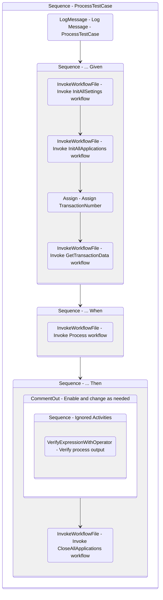

# ProcessTestCase
Class: ProcessTestCase

Verify if the Process workflow works as expected.
The verification should check whether the output of the Process workflow is the expected one.

## Workflow Details

    

    <b>Namespaces</b>
    

    
- Microsoft.VisualBasic
- Microsoft.VisualBasic.Activities
- System
- System.Activities
- System.Activities.DynamicUpdate
- System.Activities.Expressions
- System.Activities.Statements
- System.Activities.Validation
- System.Activities.XamlIntegration
- System.Collections
- System.Collections.Generic
- System.Collections.ObjectModel
- System.Data
- System.Diagnostics
- System.Drawing
- System.IO
- System.Linq
- System.Linq.Expressions
- System.Net.Mail
- System.Runtime.Serialization
- System.Text
- System.Windows.Markup
- System.Xml
- System.Xml.Linq
- UiPath.Core
- UiPath.Core.Activities
- UiPath.Shared.Activities
- UiPath.Testing
- UiPath.Testing.Activities

    

    <b>References</b>
    

- Microsoft.CSharp
- Microsoft.VisualBasic
- PresentationCore
- PresentationFramework
- System
- System.Activities
- System.ComponentModel
- System.ComponentModel.Composition
- System.ComponentModel.Primitives
- System.ComponentModel.TypeConverter
- System.Core
- System.Data
- System.Data.Common
- System.Drawing
- System.Linq
- System.ObjectModel
- System.Private.CoreLib
- System.Private.Xml
- System.Runtime.Serialization
- System.ServiceModel
- System.ServiceModel.Activities
- System.ValueTuple
- System.Xaml
- System.Xml
- System.Xml.Linq
- UiPath.Excel
- UiPath.Excel.Activities
- UiPath.System.Activities
- UiPath.Testing
- UiPath.Testing.Activities
- UiPath.Workflow
- WindowsBase

    

    <b>Arguments</b>
    

| Name | Direction | Type | Description |
|  --- | --- | --- | ---  |

    

    

    <b>Workflows Used</b>
    

- C:\Users\yash.brahmbhatt\Documents\UiPath\LazyFramework\Framework\InitAllSettings.xaml
- C:\Users\yash.brahmbhatt\Documents\UiPath\LazyFramework\Framework\InitAllApplications.xaml
- C:\Users\yash.brahmbhatt\Documents\UiPath\LazyFramework\Framework\GetTransactionData.xaml
- C:\Users\yash.brahmbhatt\Documents\UiPath\LazyFramework\Framework\Process.xaml
- C:\Users\yash.brahmbhatt\Documents\UiPath\LazyFramework\Framework\CloseAllApplications.xaml

    

    

    <b>Tests</b>
    

    

## Outline (Beta)

