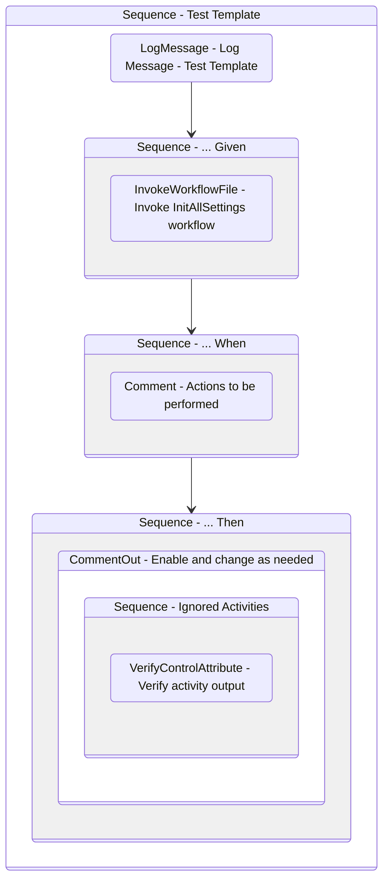

# WorkflowTestCaseTemplate
Class: TestWorkflowTemplate

Template workflow used to create tests for workflows in the process.
Create a new test workflow by copying and renaming this file.

## Workflow Details

    

    <b>Namespaces</b>
    

    
- System
- System.Activities
- System.Activities.DynamicUpdate
- System.Activities.Statements
- System.Collections
- System.Collections.Generic
- System.Collections.ObjectModel
- System.Data
- System.Linq
- System.Linq.Expressions
- System.Reflection
- System.Runtime.InteropServices
- System.Runtime.Serialization
- System.Text
- UiPath.Core
- UiPath.Core.Activities
- UiPath.Shared.Activities
- UiPath.Testing
- UiPath.Testing.Activities

    

    <b>References</b>
    

- Microsoft.Bcl.AsyncInterfaces
- Microsoft.CSharp
- System
- System.Activities
- System.ComponentModel.Composition
- System.ComponentModel.TypeConverter
- System.Core
- System.Data
- System.Data.Common
- System.Linq
- System.Memory
- System.ObjectModel
- System.Private.CoreLib
- System.Runtime.Serialization
- System.ServiceModel
- System.ServiceModel.Activities
- System.ValueTuple
- System.Xaml
- System.Xml
- System.Xml.Linq
- UiPath.Excel
- UiPath.Excel.Activities
- UiPath.System.Activities
- UiPath.System.Activities.Design
- UiPath.Testing
- UiPath.Testing.Activities

    

    <b>Arguments</b>
    

| Name | Direction | Type | Description |
|  --- | --- | --- | ---  |

    

    

    <b>Workflows Used</b>
    

- C:\Users\yash.brahmbhatt\Documents\UiPath\LazyFramework\Framework\InitAllSettings.xaml

    

    

    <b>Tests</b>
    

    

## Outline (Beta)

