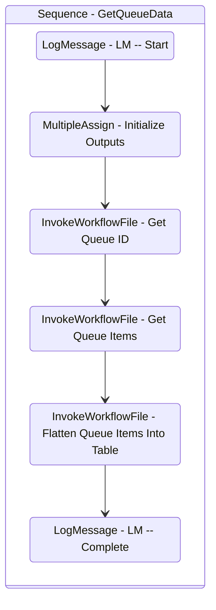

# GetQueueData
Class: GetQueueData

Gets the queue data list and parses it into a table.

## Workflow Details

    

    <b>Namespaces</b>
    

    
- Newtonsoft.Json.Linq
- System
- System.Activities
- System.Activities.Statements
- System.Collections
- System.Collections.Generic
- System.Collections.ObjectModel
- System.Data
- System.Linq
- System.Runtime.Serialization
- UiPath.Core.Activities

    

    <b>References</b>
    

- Microsoft.CSharp
- Microsoft.VisualBasic
- Microsoft.Win32.Primitives
- netstandard
- Newtonsoft.Json
- NPOI
- PresentationFramework
- System
- System.Activities
- System.Collections
- System.ComponentModel
- System.ComponentModel.EventBasedAsync
- System.ComponentModel.Primitives
- System.ComponentModel.TypeConverter
- System.Configuration.ConfigurationManager
- System.Console
- System.Core
- System.Data
- System.Data.Common
- System.Data.SqlClient
- System.Linq
- System.Linq.Expressions
- System.Memory
- System.Memory.Data
- System.ObjectModel
- System.Private.CoreLib
- System.Private.DataContractSerialization
- System.Private.ServiceModel
- System.Private.Uri
- System.Private.Xml
- System.Reflection.DispatchProxy
- System.Reflection.Metadata
- System.Reflection.TypeExtensions
- System.Runtime.Serialization
- System.Runtime.Serialization.Formatters
- System.Runtime.Serialization.Primitives
- System.Security.Permissions
- System.ServiceModel
- System.ServiceModel.Activities
- System.Xaml
- System.Xml
- System.Xml.Linq
- UiPath.Studio.Constants
- UiPath.System.Activities
- UiPath.System.Activities.Design
- UiPath.System.Activities.ViewModels
- UiPath.Workflow
- WindowsBase

    

    <b>Arguments</b>
    

| Name | Direction | Type | Description |
|  --- | --- | --- | ---  |
| out_QueueList | OutArgument | scg:List(njl:JToken) | The unformatted list of queue items retrieved, as a List of JToken. |
| in_QueueName | InArgument | x:String | The name of the queue to report. |
| in_QueueFolder | InArgument | x:String | The path fo the folder that houses the queue to report. |
| in_From | InArgument | s:DateTime | The start of the reporting range. |
| in_To | InArgument | s:DateTime | The end of the reporting range. |
| in_Statuses | InArgument | s:String[] | The statuses to include when retrieving queue items. |
| out_dt_QueueTable | OutArgument | sd:DataTable | The queue items retrieved, formatted as a flattened table. |

    

    

    <b>Workflows Used</b>
    

- C:\Users\yash.brahmbhatt\Documents\UiPath\LazyFramework\.templates\Reporters\Basic\Orchestrator\GetQueueDefinitionId.xaml
- C:\Users\yash.brahmbhatt\Documents\UiPath\LazyFramework\.templates\Reporters\Basic\Orchestrator\GetQueueItems.xaml
- C:\Users\yash.brahmbhatt\Documents\UiPath\LazyFramework\.templates\Reporters\Basic\Logic\Flatten.xaml

    

    

    <b>Tests</b>
    

    

## Outline (Beta)

