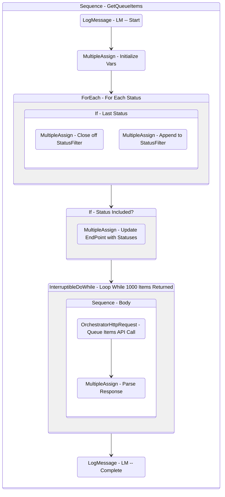

# GetQueueItems
Class: GetQueueItems

Retrieves all queue items for a particular queue id into a list.

## Workflow Details

    

    <b>Namespaces</b>
    

    
- System.Activities
- System.Activities.Statements
- System
- System.Collections
- System.Collections.Generic
- System.Collections.ObjectModel
- System.Linq
- UiPath.Core.Activities
- System.Reflection
- System.Runtime.Serialization
- Newtonsoft.Json.Linq
- Newtonsoft.Json
- System.Dynamic
- UiPath.Core.Activities.Orchestrator
- System.ComponentModel
- System.Collections.Specialized

    

    <b>References</b>
    

- Microsoft.CSharp
- Microsoft.VisualBasic
- Microsoft.Win32.Primitives
- netstandard
- Newtonsoft.Json
- NPOI
- PresentationFramework
- System
- System.Activities
- System.Collections
- System.Collections.Immutable
- System.Collections.NonGeneric
- System.Collections.Specialized
- System.ComponentModel
- System.ComponentModel.EventBasedAsync
- System.ComponentModel.Primitives
- System.ComponentModel.TypeConverter
- System.Configuration.ConfigurationManager
- System.Console
- System.Core
- System.Data
- System.Data.Common
- System.Linq
- System.Linq.Expressions
- System.Linq.Parallel
- System.Linq.Queryable
- System.Memory
- System.Memory.Data
- System.ObjectModel
- System.Private.CoreLib
- System.Private.DataContractSerialization
- System.Private.ServiceModel
- System.Private.Uri
- System.Reflection.DispatchProxy
- System.Reflection.Metadata
- System.Reflection.TypeExtensions
- System.Runtime.Serialization
- System.Runtime.Serialization.Formatters
- System.Runtime.Serialization.Primitives
- System.Security.Permissions
- System.ServiceModel
- System.ServiceModel.Activities
- System.Xaml
- System.Xml
- System.Xml.Linq
- UiPath.Studio.Constants
- UiPath.System.Activities
- UiPath.Workflow
- WindowsBase

    

    <b>Arguments</b>
    

| Name | Direction | Type | Description |
|  --- | --- | --- | ---  |
| in_QueueId | InArgument | x:Int32 | The ID of the queue to get queue items for. |
| in_From | InArgument | s:DateTime | The start of the reporting range. |
| in_To | InArgument | s:DateTime | The end of the reporting period. |
| in_Statuses | InArgument | s:String[] | A list of the statuses to include in the output queue items list. |
| out_QueueItems | OutArgument | scg:List(njl:JToken) | The list of queue items retrieved. |

    

    

    <b>Workflows Used</b>
    

    

    

    <b>Tests</b>
    

    

## Outline (Beta)

