# DocumentProject
Class: DocumentProject

Documents the current project into markdown in the following manner:

1. Pages for each workflow showing the description, arguments, dependencies, and imports

2. Project Summary page that indicates the type, version, studio version, language, description, dependencies, and entry points of the project.

## Workflow Details

    

    <b>Namespaces</b>
    

    
- System.Activities
- System.Activities.Statements
- System
- System.Collections
- System.Collections.Generic
- System.Collections.ObjectModel
- System.Data
- System.Linq
- UiPath.Core.Activities
- System.Reflection
- System.IO
- System.Runtime.Serialization
- UiPath.Platform.ResourceHandling
- System.ComponentModel
- System.Xml.Serialization
- System.ComponentModel
- System.Xml.Serialization
- UiPath.Core
- GlobalVariablesNamespace
- GlobalConstantsNamespace
- System.Linq.Expressions
- System.Xml.Linq

    

    <b>References</b>
    

- Microsoft.CSharp
- Microsoft.VisualBasic
- Microsoft.Win32.Primitives
- NPOI
- PresentationFramework
- System
- System.Activities
- System.Collections
- System.Collections.Immutable
- System.ComponentModel
- System.ComponentModel.EventBasedAsync
- System.ComponentModel.Primitives
- System.ComponentModel.TypeConverter
- System.Configuration.ConfigurationManager
- System.Console
- System.Core
- System.Data
- System.Data.Common
- System.Data.SqlClient
- System.IO.FileSystem.AccessControl
- System.IO.FileSystem.DriveInfo
- System.IO.FileSystem.Watcher
- System.IO.Packaging
- System.Linq
- System.Linq.Expressions
- System.Linq.Parallel
- System.Linq.Queryable
- System.Memory
- System.Memory.Data
- System.ObjectModel
- System.Private.CoreLib
- System.Private.DataContractSerialization
- System.Private.ServiceModel
- System.Private.Uri
- System.Private.Xml
- System.Private.Xml.Linq
- System.Reflection.DispatchProxy
- System.Reflection.Metadata
- System.Reflection.TypeExtensions
- System.Runtime.Serialization
- System.Runtime.Serialization.Formatters
- System.Runtime.Serialization.Primitives
- System.Security.Permissions
- System.ServiceModel
- System.ServiceModel.Activities
- System.Xaml
- System.Xml
- System.Xml.Linq
- System.Xml.ReaderWriter
- UiPath.Platform
- UiPath.Studio.Constants
- UiPath.System.Activities
- UiPath.System.Activities.Design
- UiPath.System.Activities.ViewModels
- UiPath.Workflow
- WindowsBase

    

    <b>Arguments</b>
    

| Name | Direction | Type | Description |
|  --- | --- | --- | ---  |

    

    

    <b>Workflows Used</b>
    

- C:\Users\yash.brahmbhatt\Documents\UiPath\LazyFramework\Design\AutoDocs\ParseProjectJSON.xaml
- C:\Users\yash.brahmbhatt\Documents\UiPath\LazyFramework\Design\AutoDocs\ParseWorkflow.xaml
- C:\Users\yash.brahmbhatt\Documents\UiPath\LazyFramework\Design\AutoDocs\DataTableToMarkdown.xaml

    

    

    <b>Tests</b>
    

    

## Outline (Beta)

```mermaid
stateDiagram-v2


Sequence_1: Sequence - DocumentProject
state Sequence_1 {
direction TB
LogMessage_1 : LogMessage - LM -- Start
MultipleAssign_1 : MultipleAssign - Initialize Vars
LogMessage_1 --> MultipleAssign_1
InvokeWorkflowFile_3 : InvokeWorkflowFile - ParseProjectJSON.xaml - Invoke Workflow File
MultipleAssign_1 --> InvokeWorkflowFile_3
MultipleAssign_3 : MultipleAssign - Get Test Workflows
InvokeWorkflowFile_3 --> MultipleAssign_3
MultipleAssign_3 --> ForEach1_3
ForEach1_3: ForEach - For Each Test
state ForEach1_3 {
direction TB

Sequence_5: Sequence - Parse Test
state Sequence_5 {
direction TB
InvokeWorkflowFile_4 : InvokeWorkflowFile - Parse Tests
MultipleAssign_4 : MultipleAssign - Add Values to Dictioanry
InvokeWorkflowFile_4 --> MultipleAssign_4
}
}
LogMessage_2 : LogMessage - LM -- Tests Parsed
ForEach1_3 --> LogMessage_2
InvokeWorkflowFile_6 : InvokeWorkflowFile - Dependencies to MD
LogMessage_2 --> InvokeWorkflowFile_6
MultipleAssign_5 : MultipleAssign - Set Project Content
InvokeWorkflowFile_6 --> MultipleAssign_5
MultipleAssign_5 --> If_2
If_2: If - Output Root Exists?
state If_2 {
direction TB
DeleteFolderX_2 : DeleteFolderX - Delete OutputRoot
}
CreateDirectory_2 : CreateDirectory - Create OutputRoot
If_2 --> CreateDirectory_2
WriteTextFile_2 : WriteTextFile - Write Project.md
CreateDirectory_2 --> WriteTextFile_2
WriteTextFile_2 --> ForEach1_1
ForEach1_1: ForEach - For Each Workflow
state ForEach1_1 {
direction TB

Sequence_2: Sequence - Process Workflow
state Sequence_2 {
direction TB
LogMessage_3 : LogMessage - LM -- Workflow
InvokeWorkflowFile_1 : InvokeWorkflowFile - Parse Workflow
LogMessage_3 --> InvokeWorkflowFile_1
InvokeWorkflowFile_7 : InvokeWorkflowFile - Arguments To MD
InvokeWorkflowFile_1 --> InvokeWorkflowFile_7
MultipleAssign_2 : MultipleAssign - Set Output Vars
InvokeWorkflowFile_7 --> MultipleAssign_2
MultipleAssign_2 --> If_1
If_1: If - Relative Folder Exists?
state If_1 {
direction TB
CreateDirectory_3 : CreateDirectory - Create Relative Folder
}
WriteTextFile_1 : WriteTextFile - Write Workflow.md
If_1 --> WriteTextFile_1
}
}
LogMessage_4 : LogMessage - LM -- Complete
ForEach1_1 --> LogMessage_4
}
```

