# AddModules
Class: AddModules

Accelerates creating new modules by prompting the user for set of modules they want to create, and copies the configs, templates, and all workflow files for that module.

## Workflow Details

    

    <b>Namespaces</b>
    

    
- System.Activities
- System.Activities.Statements
- System
- System.Collections
- System.Collections.Generic
- System.Collections.ObjectModel
- System.Data
- System.Linq
- UiPath.Core.Activities
- System.Runtime.Serialization
- System.Reflection
- System.IO
- System.ComponentModel
- System.Xml.Serialization
- System.ComponentModel
- System.Xml.Serialization
- UiPath.DataTableUtilities
- UiPath.Platform.ResourceHandling
- UiPath.Excel
- UiPath.Excel.Activities.Business
- UiPath.Excel.Model
- UiPath.Shared.Activities.Business
- UiPath.Form.Activities
- Newtonsoft.Json
- Newtonsoft.Json.Linq
- System.Collections.Specialized
- System.Dynamic
- UiPath.Core
- GlobalVariablesNamespace
- GlobalConstantsNamespace

    

    <b>References</b>
    

- Microsoft.CSharp
- Microsoft.VisualBasic
- Microsoft.Win32.Primitives
- netstandard
- Newtonsoft.Json
- NPOI
- PresentationFramework
- System
- System.Activities
- System.Collections
- System.Collections.Immutable
- System.Collections.NonGeneric
- System.Collections.Specialized
- System.ComponentModel
- System.ComponentModel.EventBasedAsync
- System.ComponentModel.Primitives
- System.ComponentModel.TypeConverter
- System.Configuration.ConfigurationManager
- System.Console
- System.Core
- System.Data
- System.Data.Common
- System.Data.SqlClient
- System.IO.FileSystem.AccessControl
- System.IO.FileSystem.DriveInfo
- System.IO.FileSystem.Watcher
- System.IO.Packaging
- System.Linq
- System.Linq.Expressions
- System.Linq.Parallel
- System.Linq.Queryable
- System.Memory
- System.Memory.Data
- System.ObjectModel
- System.Private.CoreLib
- System.Private.DataContractSerialization
- System.Private.ServiceModel
- System.Private.Uri
- System.Private.Xml
- System.Reflection.DispatchProxy
- System.Reflection.Metadata
- System.Reflection.TypeExtensions
- System.Runtime.Serialization
- System.Runtime.Serialization.Formatters
- System.Runtime.Serialization.Primitives
- System.Security.Permissions
- System.ServiceModel
- System.ServiceModel.Activities
- System.Xaml
- System.Xml
- System.Xml.Linq
- System.Xml.ReaderWriter
- UiPath.Excel
- UiPath.Excel.Activities
- UiPath.Excel.Activities.Design
- UiPath.Form.Activities
- UiPath.Mail.Activities
- UiPath.Persistence.Activities
- UiPath.Platform
- UiPath.Studio.Constants
- UiPath.System.Activities
- UiPath.System.Activities.Design
- UiPath.System.Activities.ViewModels
- UiPath.Testing.Activities
- UiPath.Workflow
- WindowsBase

    

    <b>Arguments</b>
    

| Name | Direction | Type | Description |
|  --- | --- | --- | ---  |

    

    

    <b>Workflows Used</b>
    

- C:\Users\yash.brahmbhatt\Documents\UiPath\LazyFramework\Shared\LoadConfig.xaml

    

    

    <b>Tests</b>
    

    

## Outline (Beta)

```mermaid
stateDiagram-v2


Sequence_1: Sequence - AddModules
state Sequence_1 {
direction TB
LogMessage_1 : LogMessage - LM -- Start
InvokeWorkflowFile_2 : InvokeWorkflowFile - LoadConfig.xaml - Invoke Workflow File
LogMessage_1 --> InvokeWorkflowFile_2
MultipleAssign_1 : MultipleAssign - Parse Config
InvokeWorkflowFile_2 --> MultipleAssign_1
LogMessage_2 : LogMessage - LM -- Form Start
MultipleAssign_1 --> LogMessage_2
FormActivity_1 : FormActivity - Show Add Modules Form
LogMessage_2 --> FormActivity_1
MultipleAssign_15 : MultipleAssign - Get Modules Table
FormActivity_1 --> MultipleAssign_15
LogMessage_3 : LogMessage - LM -- Form Complete
MultipleAssign_15 --> LogMessage_3
LogMessage_3 --> ForEachRow_1
ForEachRow_1: ForEachRow - For Each Module
state ForEachRow_1 {
direction TB

Sequence_3: Sequence - Create Module
state Sequence_3 {
direction TB
LogMessage_4 : LogMessage - LM -- Module Start
MultipleAssign_2 : MultipleAssign - Parse Values
LogMessage_4 --> MultipleAssign_2
MultipleAssign_2 --> ForEach1_6
ForEach1_6: ForEach - Copy All Files From Modules Root
state ForEach1_6 {
direction TB

Sequence_22: Sequence - Copy File
state Sequence_22 {
direction TB
MultipleAssign_13 : MultipleAssign - Set Target Path
MultipleAssign_13 --> If_8
If_8: If - File Folder Exists?
state If_8 {
direction TB
CreateDirectory_5 : CreateDirectory - Create File Folder
}
If_8 --> If_6
If_6: If - Workflow File?
state If_6 {
direction TB

Sequence_23: Sequence - Is Workflow
state Sequence_23 {
direction TB
ReadTextFile_2 : ReadTextFile - Read File
ReadTextFile_2 --> If_7
If_7: If - Folder Exists for File?
state If_7 {
direction TB
CreateDirectory_4 : CreateDirectory - Create Folder For File
}
MultipleAssign_14 : MultipleAssign - Replace Invoke Paths
If_7 --> MultipleAssign_14
WriteTextFile_2 : WriteTextFile - Write Target File
MultipleAssign_14 --> WriteTextFile_2
}
CopyFile_5 : CopyFile - Copy Other File
}
}
}
ForEach1_6 --> RetryScope_1
RetryScope_1: RetryScope - Access Is Denied Wait/Retry
state RetryScope_1 {
direction TB

ExcelProcessScopeX_1: ExcelProcessScopeX - Update Config File
state ExcelProcessScopeX_1 {
direction TB

ExcelApplicationCard_1: ExcelApplicationCard - Use Excel File
state ExcelApplicationCard_1 {
direction TB

ForEachSheetX_1: ForEachSheetX - For Each Excel Sheet
state ForEachSheetX_1 {
direction TB

ExcelForEachRowX_1: ExcelForEachRowX - For Each Excel Row
state ExcelForEachRowX_1 {
direction TB

If_5: If - Not Empty Row?
state If_5 {
direction TB

Switch1_1: Switch - Sheet Name?
state Switch1_1 {
direction TB
MultipleAssign_17 : MultipleAssign - Update Path (TextFiles)
MultipleAssign_16 : MultipleAssign - Update Path (ExcelFiles)
MultipleAssign_17 --> MultipleAssign_16
}
}
}
}
}
}
}
RetryScope_1 --> CommentOut_1
CommentOut_1: CommentOut - Disabled -- Add GlobalConstants for Config Paths
state CommentOut_1 {
direction TB

Sequence_28: Sequence - Update Global Vars
state Sequence_28 {
direction TB
ReadTextFile_3 : ReadTextFile - Read Global Vars File
MultipleAssign_19 : MultipleAssign - Parse Global Vars
ReadTextFile_3 --> MultipleAssign_19
AddToCollection1_1 : AddToCollection - Add Module ConfigPath Global Vars
MultipleAssign_19 --> AddToCollection1_1
MultipleAssign_20 : MultipleAssign - Serialize Global Vars
AddToCollection1_1 --> MultipleAssign_20
WriteTextFile_3 : WriteTextFile - Write Global Vars File
MultipleAssign_20 --> WriteTextFile_3
}
}
LogMessage_6 : LogMessage - LM -- Module Complete
CommentOut_1 --> LogMessage_6
}
}
}
```

