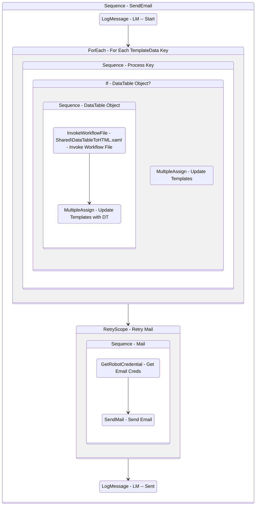

# SendEmail
Class: SendEmail

Sends an email taking a dictionary of data to fill out template subject and body fields. Supports DataTable to HTML <table> objects as well.

## Workflow Details

    

    <b>Namespaces</b>
    

    
- System
- System.Activities
- System.Activities.Statements
- System.Collections
- System.Collections.Generic
- System.Collections.ObjectModel
- System.Data
- System.Linq
- System.Net.Mail
- System.Reflection
- System.Runtime.Serialization
- System.Security
- UiPath.Core.Activities
- UiPath.Mail
- UiPath.Mail.Activities
- UiPath.Mail.SMTP.Activities
- UiPath.Shared.Activities

    

    <b>References</b>
    

- Microsoft.CSharp
- Microsoft.VisualBasic
- Microsoft.Win32.Primitives
- NPOI
- PresentationFramework
- System
- System.Activities
- System.Collections
- System.ComponentModel
- System.ComponentModel.EventBasedAsync
- System.ComponentModel.Primitives
- System.ComponentModel.TypeConverter
- System.Configuration.ConfigurationManager
- System.Console
- System.Core
- System.Data
- System.Data.Common
- System.Data.SqlClient
- System.Linq
- System.Linq.Expressions
- System.Memory
- System.Memory.Data
- System.Net.Mail
- System.ObjectModel
- System.Private.CoreLib
- System.Private.DataContractSerialization
- System.Private.ServiceModel
- System.Private.Uri
- System.Private.Xml
- System.Reflection.DispatchProxy
- System.Reflection.Metadata
- System.Reflection.TypeExtensions
- System.Runtime.InteropServices
- System.Runtime.Serialization
- System.Runtime.Serialization.Formatters
- System.Runtime.Serialization.Primitives
- System.Security.Permissions
- System.ServiceModel
- System.ServiceModel.Activities
- System.Xaml
- System.Xml
- System.Xml.Linq
- UiPath.Excel.Activities
- UiPath.Mail
- UiPath.Mail.Activities
- UiPath.Mail.Activities.Design
- UiPath.Studio.Constants
- UiPath.System.Activities
- UiPath.System.Activities.Design
- UiPath.System.Activities.ViewModels
- UiPath.Testing.Activities
- UiPath.Workflow
- WindowsBase

    

    <b>Arguments</b>
    

| Name | Direction | Type | Description |
|  --- | --- | --- | ---  |
| in_To | InArgument | x:String | Who to send the email to. |
| in_Subject | InArgument | x:String | The templated subject of the email to send. |
| in_Body | InArgument | x:String | The templated body of the email to send in HTML format. |
| in_Attachments | InArgument | scg:IEnumerable(x:String) | An array of file paths to include as attachments in the email. |
| in_Port | InArgument | x:Int32 | The SMTP port to use when sending emails. |
| in_Server | InArgument | x:String | The SMTP server to use for sending emails. |
| in_CredentialFolder | InArgument | x:String | The name of the Orchestrator folder that holds the credential asset for authenticating to the SMTP server. |
| in_CredentialName | InArgument | x:String | The name of the credential asset for authenticating to the SMTP server. |
| in_CC | InArgument | x:String | Who to CC on the email. |
| in_TemplateData | InArgument | scg:Dictionary(x:String, x:Object) | A dictionary of variables to replace in the template. Keys must match the value in the template. |

    

    

    <b>Workflows Used</b>
    

- C:\Users\yash.brahmbhatt\Documents\UiPath\LazyFramework\Shared\DataTableToHTML.xaml

    

    

    <b>Tests</b>
    

- Shared\Tests\SendEmail\SendEmailSuccess.xaml

    

## Outline (Beta)

