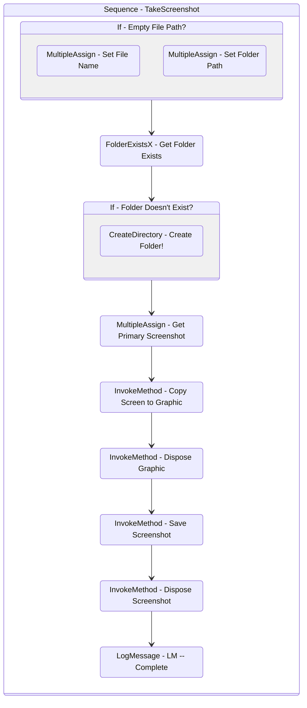

# TakeScreenshot
Class: TakeScreenshot

Takes a screenshot and saves it to a folder.

## Workflow Details

    

    <b>Namespaces</b>
    

    
- System
- System.Activities
- System.Activities.Statements
- System.Collections
- System.Collections.Generic
- System.Collections.ObjectModel
- System.Drawing
- System.Drawing.Imaging
- System.IO
- System.Linq
- System.Reflection
- System.Runtime.Serialization
- System.Windows.Forms
- UiPath.Core.Activities
- UiPath.Platform.ResourceHandling

    

    <b>References</b>
    

- Microsoft.CSharp
- Microsoft.VisualBasic
- NPOI
- System
- System.Activities
- System.ComponentModel
- System.ComponentModel.TypeConverter
- System.Configuration.ConfigurationManager
- System.Console
- System.Core
- System.Data
- System.Data.Common
- System.Drawing.Common
- System.Drawing.Primitives
- System.IO.FileSystem.AccessControl
- System.IO.FileSystem.DriveInfo
- System.IO.FileSystem.Watcher
- System.IO.Packaging
- System.Linq
- System.Memory
- System.Memory.Data
- System.ObjectModel
- System.Private.CoreLib
- System.Private.DataContractSerialization
- System.Private.ServiceModel
- System.Private.Uri
- System.Reflection.DispatchProxy
- System.Reflection.Metadata
- System.Reflection.TypeExtensions
- System.Runtime.Serialization
- System.Runtime.Serialization.Formatters
- System.Runtime.Serialization.Primitives
- System.Security.Permissions
- System.ServiceModel
- System.ServiceModel.Activities
- System.Windows.Forms
- System.Windows.Forms.Primitives
- System.Xaml
- System.Xml
- System.Xml.Linq
- UiPath.Excel.Activities
- UiPath.Mail.Activities
- UiPath.Platform
- UiPath.Studio.Constants
- UiPath.System.Activities
- UiPath.System.Activities.Design
- UiPath.System.Activities.ViewModels
- UiPath.Testing.Activities
- UiPath.Workflow

    

    <b>Arguments</b>
    

| Name | Direction | Type | Description |
|  --- | --- | --- | ---  |
| in_FolderPath | InArgument | x:String | The path to the folder to save screenshots to. |
| io_FilePath | InOutArgument | x:String | If specified, overrides the folder path and uses this path for the file name. Otherwise, it just outputs the full path to the screenshot. |

    

    

    <b>Workflows Used</b>
    

    

    

    <b>Tests</b>
    

- Shared\Tests\TakeScreenshot\TakeScreenshotNoPath.xaml
- Shared\Tests\TakeScreenshot\TakeScreenshotPath.xaml

    

## Outline (Beta)

