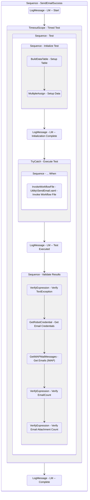

# SendEmailSuccess
Class: SendEmailSuccess

Sends an email from subject and body templates, replacing any {} values with the correlated key in the template dictionary. Also tests that attachments go through.

## Workflow Details

    

    <b>Namespaces</b>
    

    
- System.Activities
- System.Activities.Statements
- System
- System.Collections
- System.Collections.Generic
- System.Data
- System.IO
- System.Linq
- System.Net.Mail
- UiPath.Core.Activities
- System.Collections.ObjectModel
- System.Runtime.Serialization
- System.Reflection
- UiPath.Testing.Activities
- UiPath.Shared.Activities
- System.Activities.Runtime.Collections
- System.ComponentModel
- System.Xml.Serialization
- System.Security
- UiPath.Mail
- UiPath.Mail.IMAP.Activities
- UiPath.Mail.Activities
- UiPath.Core
- GlobalVariablesNamespace
- GlobalConstantsNamespace

    

    <b>References</b>
    

- Microsoft.CSharp
- Microsoft.VisualBasic
- mscorlib
- NPOI
- PresentationCore
- PresentationFramework
- System
- System.Activities
- System.ComponentModel
- System.ComponentModel.TypeConverter
- System.Configuration.ConfigurationManager
- System.Console
- System.Core
- System.Data
- System.Drawing
- System.Linq
- System.Linq.Expressions
- System.Memory
- System.Memory.Data
- System.ObjectModel
- System.Private.CoreLib
- System.Private.DataContractSerialization
- System.Private.ServiceModel
- System.Private.Uri
- System.Reflection.DispatchProxy
- System.Reflection.Metadata
- System.Reflection.TypeExtensions
- System.Runtime.Serialization
- System.Runtime.Serialization.Formatters
- System.Runtime.Serialization.Primitives
- System.Security.Permissions
- System.ServiceModel
- System.ServiceModel.Activities
- System.Xaml
- System.Xml
- System.Xml.Linq
- UiPath.Excel
- UiPath.Excel.Activities
- UiPath.Mail.Activities
- UiPath.Studio.Constants
- UiPath.System.Activities
- UiPath.Testing.Activities
- UiPath.Workflow
- WindowsBase
- UiPath.System.Activities.Design
- UiPath.System.Activities.ViewModels
- System.Collections
- System.IO.FileSystem.Watcher
- System.IO.Packaging
- System.IO.FileSystem.AccessControl
- System.IO.FileSystem.DriveInfo
- System.Linq.Parallel
- System.Collections.Immutable
- System.Linq.Queryable
- System.ComponentModel.EventBasedAsync
- Microsoft.Win32.Primitives
- System.ComponentModel.Primitives
- System.Private.Xml
- System.Data.Common
- System.Data.SqlClient
- System.Runtime.InteropServices
- UiPath.Mail
- UiPath.Mail.Activities.Design
- System.Net.Mail

    

    <b>Arguments</b>
    

| Name | Direction | Type | Description |
|  --- | --- | --- | ---  |

    

    

    <b>Workflows Used</b>
    

- C:\Users\yash.brahmbhatt\Documents\UiPath\LazyFramework\Shared\SendEmail.xaml

    

    

    <b>Tests</b>
    

    

## Outline (Beta)

